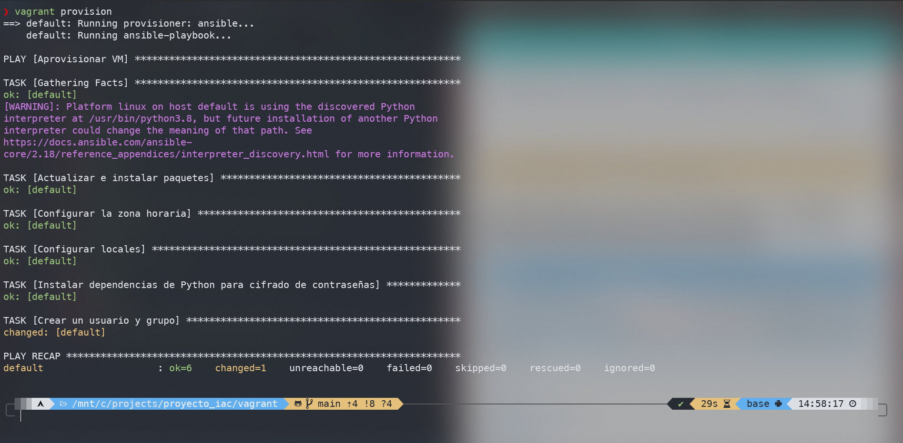
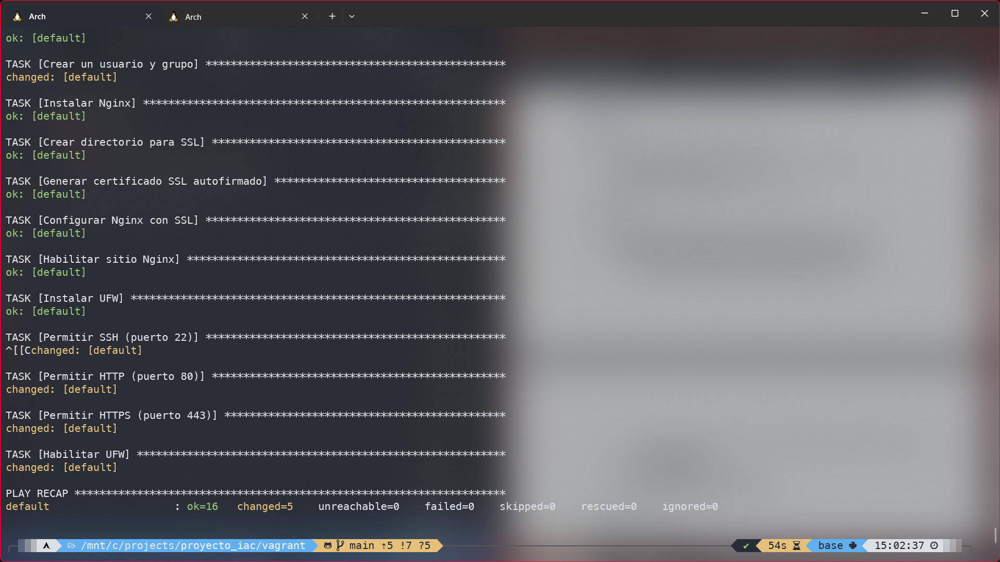
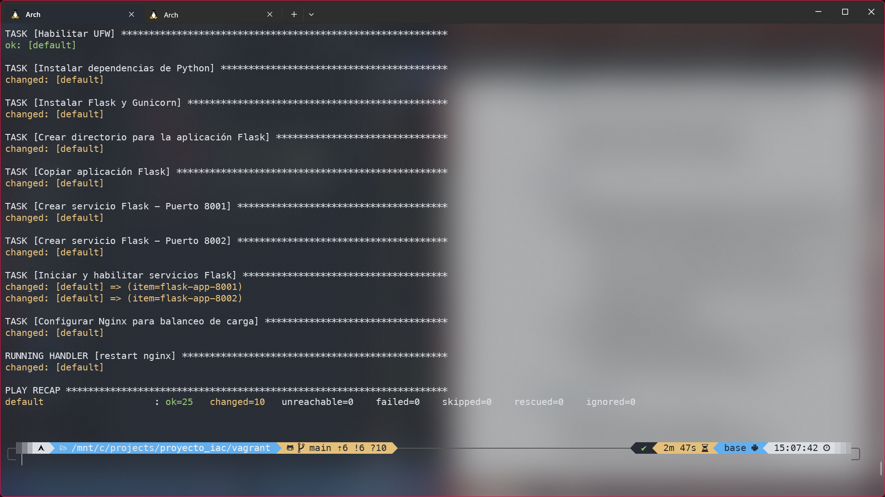
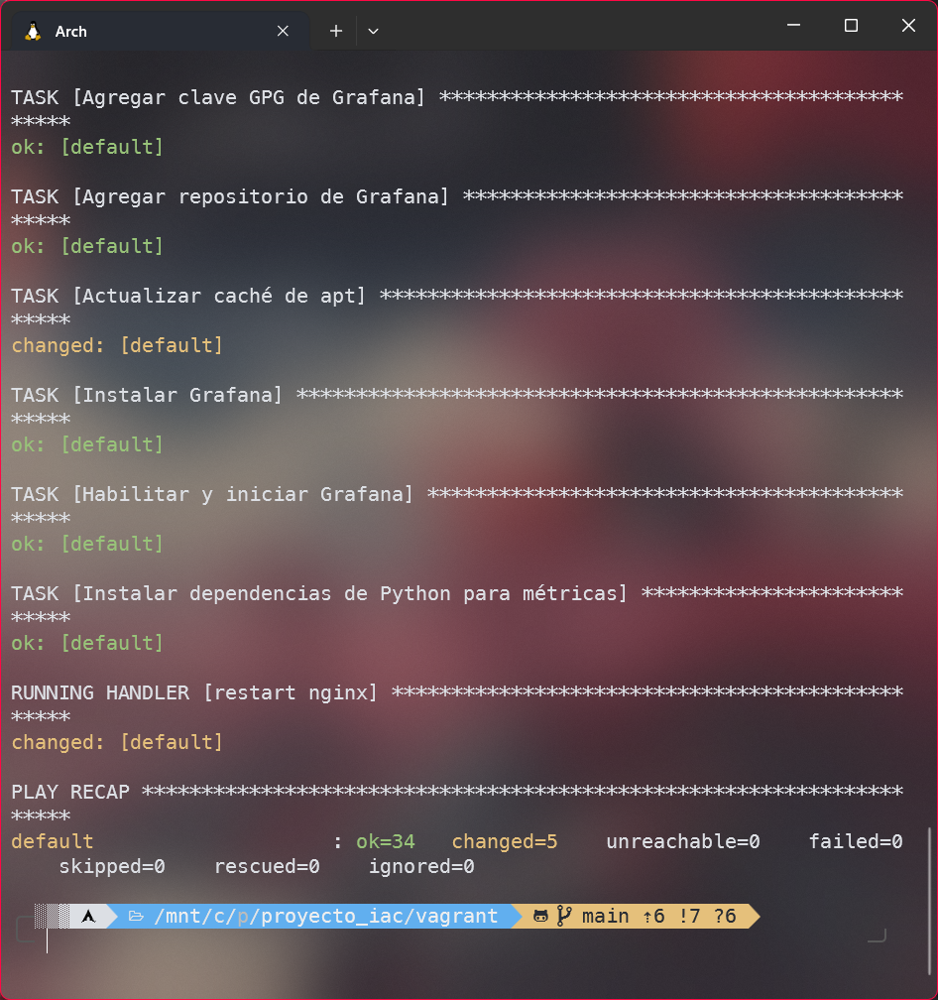

# Solución a la práctica calificada 5
**Nombre:** André Joaquín Pacheco Taboada
**Código:** 20222189G
**Correo:** andre.pacheco.t@uni.pe
**Curso:** Desarrollo de Software
**Fecha:** 02/12/2024

## Entorno Vagrant


## Ejercicio 1
Para este ejercicio se creó el playbook [main.yml](ansible/ejercicio1/main.yml) que se encarga de configurar la máquina virtual con los siguientes requerimientos:
- Actualizar e instalar paquetes
    Usé la misma tarea que se implementó en el laboratorio.
- Configurar la zona horaria y locales a America/Lima
    Para esto se usó el módulo `timezone` para configurar la zona horaria y el módulo `locale_gen` para configurar los locales.
    Referencias:
    https://gist.github.com/ZeroDeth/4900c65af505f5398bd6db94cf4a54d4
    https://docs.ansible.com/ansible/latest/collections/community/general/locale_gen_module.html
    Nota: le puse become: true para activar escalado de privilegios, cosa que vi en la documentación de Ansible.
- Crear un usuario y grupo con permisos de administrador, con contraseña cifrada.
    Para esto se usó el módulo `user` con el parámetro `pwdhash` para establecer la contraseña del usuario.
    ```
    password: "{{ 'contracifrada' | password_hash('sha512') }}"
    ```
    Nota: por defecto el hash es sha512, pero igual lo especifiqué para mayor transparencia.
    Referencias:
    https://docs.ansible.com/ansible/latest/collections/ansible/builtin/user_module.html
    https://docs.ansible.com/ansible/latest/collections/ansible/builtin/password_hash_filter.html



## Ejercicio 2
Para este ejercicio se creó el playbook [main.yml](ansible/ejercicio2/main.yml) que implementa un servidor web seguro con los siguientes componentes:

- Instalación y configuración de Nginx
    Se utiliza el módulo `apt` para instalar Nginx y se configura con SSL mediante una plantilla personalizada.

- Generación de certificados SSL autofirmados
    Se crea un directorio SSL y se generan certificados autofirmados usando OpenSSL con una validez de 365 días.
    ```yaml
    command: openssl req -x509 -nodes -days 365 -newkey rsa:2048 
            -keyout /etc/nginx/ssl/nginx.key 
            -out /etc/nginx/ssl/nginx.crt
    ```

- Configuración de Nginx con SSL
    Se utiliza una [plantilla](templates/nginx-ssl.conf.j2) que:
    - Redirecciona todo el tráfico HTTP a HTTPS
    - Configura los certificados SSL
    - Implementa protocolos seguros (TLSv1.2 y TLSv1.3)
    - Define cifrados seguros recomendados

- Configuración del firewall UFW
    Se configura el firewall para permitir solo el tráfico necesario:
    - SSH (puerto 22)
    - HTTP (puerto 80)
    - HTTPS (puerto 443)
    La política por defecto es denegar todo el tráfico no especificado.



## Ejercicio 3
Para este ejercicio se creó el playbook [main.yml](ansible/ejercicio3/main.yml) que implementa una aplicación web Flask con balanceo de carga. Los componentes principales son:

- Instalación del entorno Python
    Se instalan las dependencias necesarias usando el módulo `apt`:
    - python3
    - python3-pip
    - python3-venv

- Instalación de Flask y Gunicorn
    Se utiliza el módulo `pip` para instalar:
    - Flask: framework web
    - Gunicorn: servidor WSGI para producción

- Despliegue de la aplicación Flask
    Se crea una [aplicación simple](templates/app.py.j2) que muestra un mensaje y el nombre del servidor.
    La aplicación se despliega en el directorio `/opt/flask_app`.

- Configuración de servicios systemd
    Se crean dos instancias del servicio usando una [plantilla](templates/flask-app.service.j2):
    - Puerto 8001
    - Puerto 8002
    Cada servicio ejecuta la aplicación con Gunicorn usando 2 workers.

- Configuración del balanceador de carga
    Se configura Nginx como balanceador usando una [plantilla](templates/nginx-lb.conf.j2) que:
    - Define un upstream con los dos servidores Flask
    - Distribuye el tráfico entre las instancias
    - Configura los headers necesarios para el proxy inverso



## Ejercicio 4
Para este ejercicio se creó el playbook [main.yml](ansible/ejercicio4/main.yml) que implementa soluciones de monitoreo y alertas. Los componentes principales son:

- Instalación de herramientas de monitoreo
    Se instalan los siguientes componentes usando el módulo `apt`:
    - Prometheus: sistema de monitoreo y base de datos de series temporales
    - Node Exporter: exportador de métricas del sistema
    - Grafana: plataforma de visualización

- Configuración de Prometheus
    Se configura mediante una [plantilla](templates/prometheus.yml.j2) que:
    - Define un intervalo de scraping de 15 segundos
    - Configura la recolección de métricas de:
        - Node Exporter (métricas del sistema)
        - Aplicación Flask (métricas personalizadas)
    - Establece la configuración de alertas y reglas

- Integración de métricas en Flask
    Se modificó la [aplicación Flask](templates/app.py.j2) para exponer métricas usando prometheus_client:
    - Contador de requests totales
    - Contador de errores
    - Endpoint `/metrics` para exponer las métricas
    - Soporte para múltiples workers usando MultiProcessCollector

- Configuración del servicio Flask
    Se actualizó el [servicio systemd](templates/flask-app.service.j2) para soportar métricas:
    - Configuración del directorio para métricas multiprocess
    - Uso de worker_class=gthread para mejor manejo de métricas
    - Permisos adecuados para el directorio de métricas

Las métricas pueden visualizarse en:
- Prometheus: http://localhost:9090
- Grafana: http://localhost:3000
- Métricas de Flask: http://localhost:8001/metrics y http://localhost:8002/metrics



